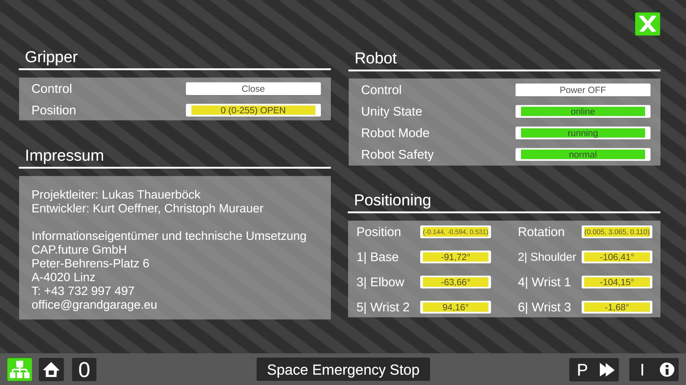

# Universal Robots Unity3D App
Control the [Universal Robots](https://www.universal-robots.com/) with Unity3D by using TCP/IP.

 

## Coming soon
### VR Support
Enter the playground in Virtual Reality.  
Support for Oculus Headset will follow soon.

### Playground
A more detailed world with interactable objects will be added

### Improved user interface
Better Design for the UI

### And more will follow

 

## License
[MIT](https://choosealicense.com/licenses/mit/)